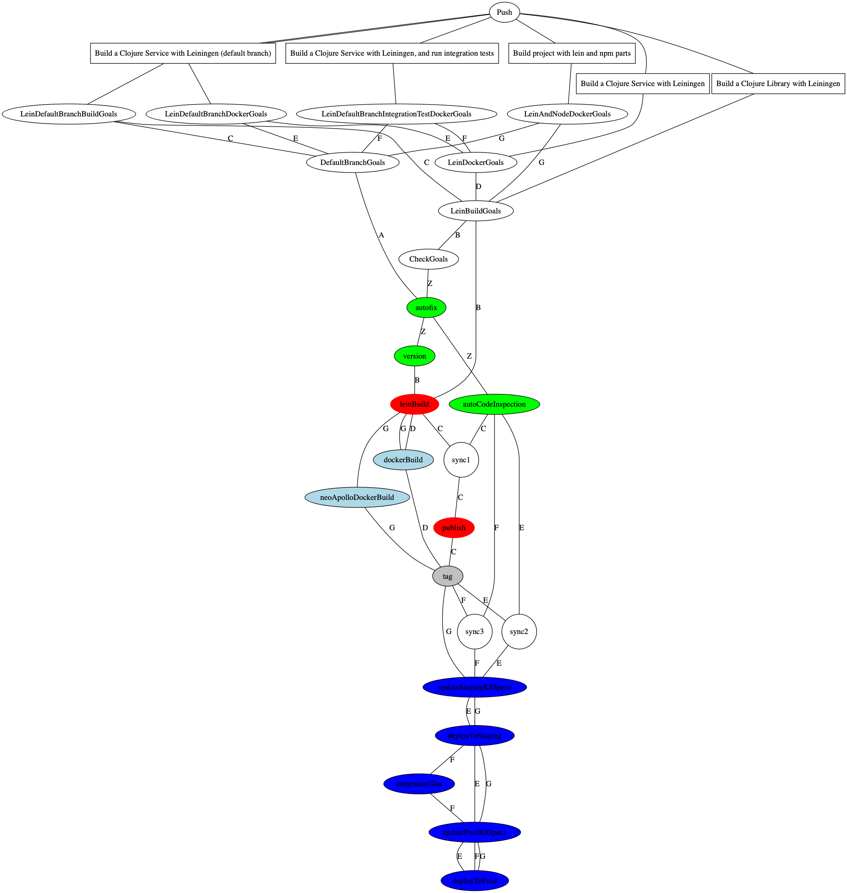

# @atomist/atomist-internal-sdm

[](https://app.atomist.com/workspace/T29E48P34)
[](https://www.npmjs.com/package/@atomist/atomist-internal-sdm)

The [Atomist][atomist] software delivery machine (SDM) for delivering
internal Atomist services.

See the [Atomist documentation][atomist-doc] for more information on
what SDMs are and what they can do for you using the Atomist API for
software.

[atomist-doc]: https://docs.atomist.com/ (Atomist Documentation)

## Push Rules and Goals



## Prerequisites

See the [Atomist Developer documentation][atomist-dev] for
instructions on setting up your development environment.  Briefly, you
will need [Git][git], [Node.js][node], and the [Atomist
CLI][atomist-cli] installed and properly configured on your system.
For this specific SDM, you will also need [Java][java] installed.
With these installed, you can run this SDM in local mode.

To run this SDM for your team, you will need an Atomist workspace.
See the [Atomist Getting Started Guide][atomist-start] for
instructions on how to get an Atomist workspace and connect it to your
source code repositories, continuous integration, chat platform, etc.

[atomist-dev]: https://docs.atomist.com/developer/prerequisites/ (Atomist - Developer Prerequisites)
[git]: https://git-scm.com/ (Git)
[atomist-cli]: https://github.com/atomist/cli (Atomist Command-Line Interface)
[atomist-start]: https://docs.atomist.com/user/ (Atomist - Getting Started)
[java]: http://openjdk.java.net/install/ (Java - Install)

## How we deliver

### Push Rules

* supports the concept of some projects only configuring goals for certain workspaces (workspace white-listing)
* we skip most npm projects unless explicitly configured to add them
* "No material change" - we have specific rules for detecting no material change on clojure projects
* "Build a project with lein and npm parts" - we support setting goals across Leiningen and Npm when they're both present
* "Build a Clojure Service with Leiningen" - Leiningen and Docker on the master branch
* Leiningen and Docker not on the master branch skips kubernetes
* "Build a Clojure Library with Leiningen" - Leiningen libraries on the master branch automatically publish
* Leiningen libraries on other branches do not publish
* "Simple node based docker service" - Node.js services with docker containers automatically update k8 specs on master branch
* Non-master branch Node services do not update k8 specs

### Packs

1.  LeinSupport - Goals for our leiningen projects
2.  fingerprintSupport - we use Fingerprints to manage shared traits like leiningen and npm dependencies
3.  goalScheduling, goalState, and githubGoalStatus are enabled

### Events and Ingestors

* PodDeployments - we have a custom ingestion for new PodDeployments
* HandleRunningPods - we have a custom event handler for the above ingestion

### Commands

* "kick service" - does nothing
* "make some noise" - generates some Pushes on Repos
* "testinate" - run platform integration tests
* "update spec" - update a k8 spec to rollback a change
* "enable deploy"
* "disable deploy"

### Goals

* NodeDockerBuild - our assumptions for dockerizing simple Node.js builds
* neoApolloDockerBuild - some additional rules for 
* deployToStaging - goal without approval 
* deployToProd - goal with approval

### Fingerprints

* docker-base-image
* elk-logback
* leiningen dependencies
* public defn bodies

## Running

See the [Atomist Developer documentation][atomist-dev] for details on
how to run this SDM.  Briefly, once the prerequisites are met on your
system you can start the SDM in local mode with the following command:

```
$ atomist start --local
```

The Atomist documentation for [running SDMs][atomist-run] has
instructions for connecting and SDM to the Atomist API for software
and running an SDM in various environments.

[atomist-run]: https://docs.atomist.com/developer/run/ (Atomist - Running SDMs)

## Support

General support questions should be discussed in the `#support`
channel in the [Atomist community Slack workspace][slack].

If you find a problem, please create an [issue][].

[issue]: https://github.com/atomist/atomist-internal-sdm/issues

## Development

You will need to install [Node.js][node] to build and test this
project.

[node]: https://nodejs.org/ (Node.js)

### Build and test

Install dependencies.

```
$ npm install
```

Use the `build` package script to compile, test, lint, and build the
documentation.

```
$ npm run build
```

### Release

Releases are handled via the [Atomist SDM][atomist-sdm].  Just press
the 'Approve' button in the Atomist dashboard or Slack.

[atomist-sdm]: https://github.com/atomist/atomist-sdm (Atomist Software Delivery Machine)

---

Created by [Atomist][atomist].
Need Help?  [Join our Slack workspace][slack].

[atomist]: https://atomist.com/ (Atomist - How Teams Deliver Software)
[slack]: https://join.atomist.com/ (Atomist Community Slack)
